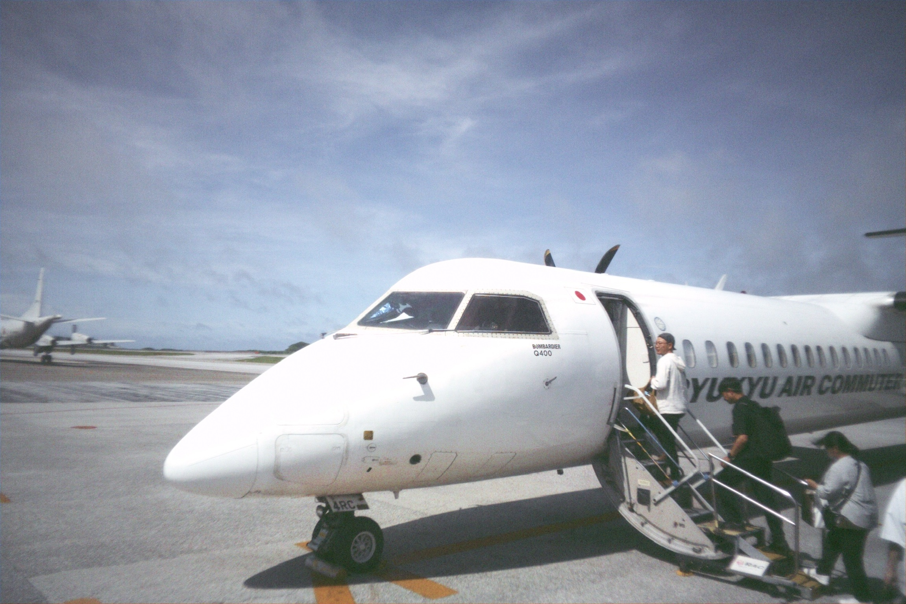
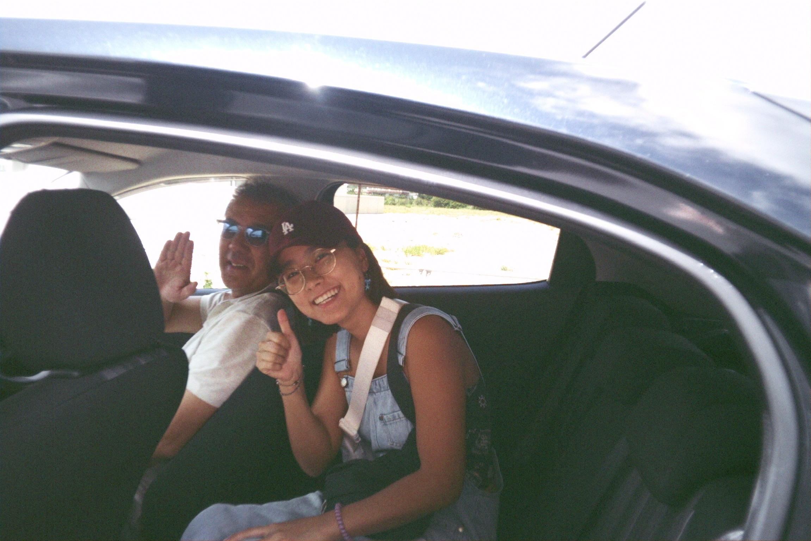
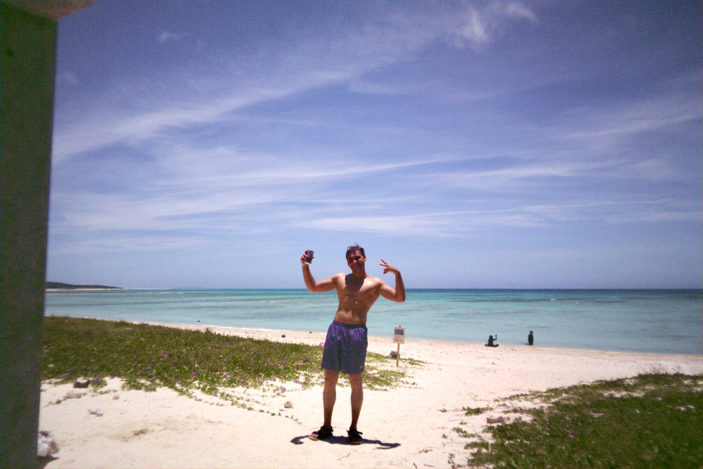
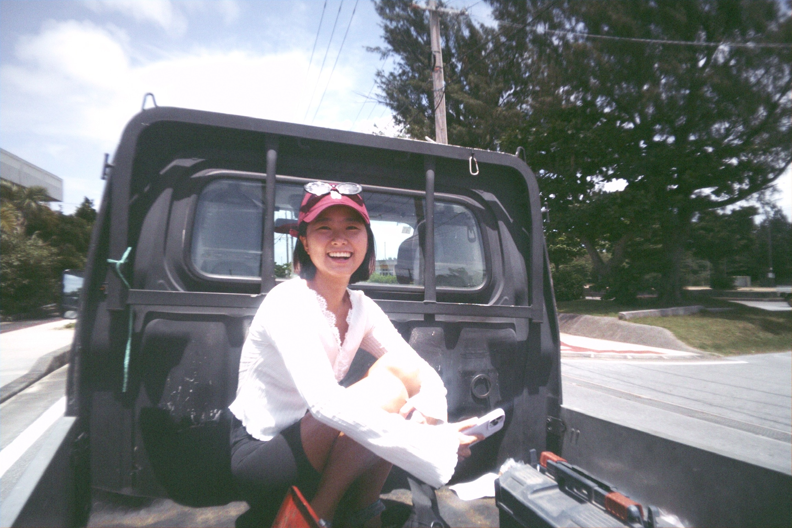
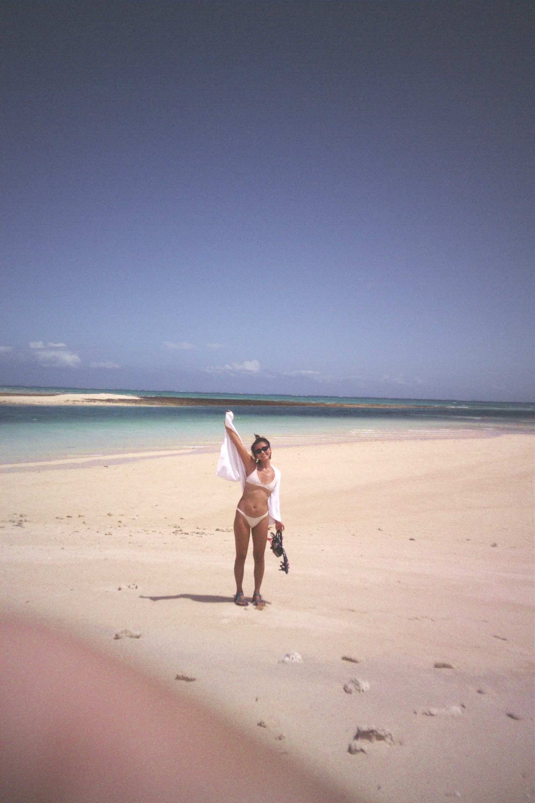

Me and my girlfriend spent about 4 days in Okinawa as a quick getaway trip.
During that time, I decided to book a flight to this super tiny island called
**Kumejima (久米島町)** - just a 30-minute flight (or a 4-hour boat ride) from
the main island. We only had 30 hours there, but honestly, it was the best
decision we made on this whole trip!

{{}}

We landed in Kumejima pretty early, around 11AM, and had a few hours to kill
before hotel check-in - and to be honest, we really didn't know what to expect.
We brought our snorkel masks from home and just hoped for the best.

According to the internet, there are only two bus lines on the island... We only
saw one — and it comes every two hours. There were also just two taxis waiting
at the airport. _Hahaha._

When we arrived, we thought: **maybe we should try to hitchhike?** I've done it
a few times before ([like here](/travel/404)) and my girlfriend really wanted to
give it a try.

And let me tell you - **it was a great success.** In just 30 hours, we managed
to hitchhike with 6 different people!

{{}}

### Snorkeling in Paradise

We only had 30 hours on this island, so we ended up going to just 3–4 beaches!

The first beach we went to was
[Eef Beach](https://maps.app.goo.gl/W2KQ57fLT64S15JSA). This place seriously
looked like paradise — 50 shades of blue in the water, pretty clean visibility,
and an amazing view all the way to the horizon. It was only a 2-minute walk from
our hotel, so it made the perfect first stop before we could check in.

We literally hid our bags and changed into swimsuits in the middle of the road.

The beach itself was great. There’s even a Family Mart within walking distance,
so we grabbed some snacks and beers. We tried snorkeling there, but because it
was a windy day, the water near the shore got pretty sandy — not the greatest
experience. After talking to some locals, we realized this is actually one of
the _least recommended_ places to snorkel in Kume...

We still saw a bunch of fish, but it was nothing compared to what came next.

Since check-in time still hadn't arrived, I was like, "Let's just walk a bit and
maybe hitchhike our way to the east side of the island." There are two tiny
islands connected to the main one by a bridge, and I thought they might be a
cool place to snorkel.

Little did I know we'd end up hitchhiking with this super friendly and kind
local named **Kairi** (you’ll hear more about him later). He picked us up,
showed us around a bit, and then drove us all the way to this spot at the edge
of the [second island](https://maps.app.goo.gl/xwuaPjyTaL3FW3v37). He told us
this was the perfect time to see sea turtles.

We were so excited. Even though low tide was starting to kick in, we grabbed our
gear and ran straight into the water.

The water was super shallow - maybe 1 meter deep at most. We saw three white
murenas swimming around, switching their little "camping spots" and hunting
small fish. Then, just as the sun hit the water at the right angle, we started
spotting them - sea turtles! So many of them, just casually swimming in the
shallow water, munching on sea grass.

We spent the next two hours walking around in the water, trying to get close to
the turtles without scaring them off. But every time they noticed us, they
zoomed away - I had no idea turtles could swim that fast.

{{}}

After that, we were completely dead. We hitchhiked back with a Japanese guy who
didn't know a single word of English, but he somehow dropped us off exactly at
our hotel. Called it a day.

Well... kind of.

Later that night we woke up starving - but turns out **almost everything on the
island closes ridiculously early**. I'm talking 7PM and you’re out of luck.
Thank god for Family Mart again. We grabbed whatever snacks we could find, and
then remembered: **Kairi**, the guy who gave us a ride earlier, had told us he
owns one of the [only bars in Kume](https://maps.app.goo.gl/jow1sUtRTk8AD8KJA),
so we decided to check it out.

We headed over and ended up spending the night hanging out with him and his
**local basketball team** - just drinking, chatting, and laughing through a mix
of broken Japanese and random Google Translates. Our Kume experience wouldn’t
have been the same without him!

 Most places in Kumejima close super early — like, 7PM early. Always
have backup snacks, or make a friend who owns a bar. 

### Kumejima Adventure Continue: The Next Day

We set the goal already at the beginning of the day: **"Today we will swim with
the turtles."** Let me tell you right away - we failed our mission. Again. But
we saw something _way_ crazier!

Kairi told us you can sometimes spot turtles on the southeast part of the second
island, so we decided to hitchhike again. This time, I think we made one of my
dreams come true - **we hitchhiked in the back of a truck!** One of those mini
Japanese trucks you only see in rural Japan or in the movies. Not the most
comfortable ride, but honestly... it was amazing. The wind in your face, ocean
views all around - we couldn't ask for a better experience.

{{}}

The driver dropped us off at the abandoned Kumejima Museum (guess we were
traveling in the off-season), and we started walking east along the coastline.
We tried to jump into the water a couple of times, but the waves were too
strong - felt unsafe - so we decided to just keep walking all the way to our
favorite turtle-spotting area.

At the eastern edge of the island, you can _literally_ see the water current
rushing between the second and third islands. For safety, we decided to snorkel
close to shore.

We jumped into the water, and not even 5 meters from the shore we saw this
sudden drop in the ocean floor - and there it was: **a beautiful coral reef**.
So many kinds of fish - cleaning fish, batfish, parrotfish, and others I have no
idea how to name. We hung around the reef for a while, and every time the
current pushed us away, we swam back. Not the safest thing we've ever done...
but also not the worst :)

We kept going, trying to spot turtles again - still no luck. We could see their
heads popping above the water, but every time we tried to swim near them, they
sped off. Still, the water was amazing, and the spot was peaceful.

Once the low tide started again, we decided to swim back toward the reef - our
starting point. And then we saw it. **A sea snake.** One of the most venomous
animals on this planet.

I completely panicked (for no legit reason) and started pushing both me and my
girlfriend back to shore. She said she's never seen me swim that fast in her
life. I really don't know what happened to me - I'm usually super calm. Maybe it
was the current, maybe it was the long snorkel session. Maybe just my brain
bugging out.

Still - it was an amazing experience. Once we were back on shore, I even jumped
back in one last time to explore the reef a bit more. I wish we had more time to
fully explore it... but we had to head back to the airport for our flight back
to the Okinawa main island.

{{}}

### Final Thoughts from Kume

We honestly loved every second of being in Kume. Our 1.5 days were definitely
not enough - I wish we had at least 2 more days to explore the island properly.
Maybe even go SUP paddling with Kairi like we talked about.

This island just felt different. We met some of the nicest people we've ever met
in Japan, and the vibe overall was super welcoming and laid-back. Great weather,
and honestly - one of the nicest beaches I've ever been to in my life.

If you're ever in Okinawa and wondering if it's worth the detour - it is. The
island isn't too touristic, so you can have most of the beaches to yourself.
Definitely take advantage of that. 😉

### Our Hidden Gems list

- 🍦
  [Kumejimaru Cafe (くめじまーるカフェ)](https://maps.app.goo.gl/JGNr577QPJM2upbe9) -
  Salted ice cream in a giant cone. must try!
- 🏪 [FamilyMart](https://maps.app.goo.gl/fj6jyqhX7P8m3fXEA) - The place that
  saved our lives many times – be aware: closes at 11PM.
- 🍜 [Namiji resturant](https://maps.app.goo.gl/mLBgT86jMnRHBoLh6) - Great place
  to try local Kume meal.
- 🍻 [Bar Cheers](https://maps.app.goo.gl/wkaYX9maJ1QZ4w97A) - The Best ~~and
  only~~ bar in Kume! (shout out to our friend
  [@Kairi](https://www.instagram.com/9_kairi_kyrie_9/)
- **🏖️ Beaches:**
  - 🌊 [Eef Beach](https://maps.app.goo.gl/qcjAje61gXbxXvU6A) - Amazing views
    and the best place to bath around.
  - 🐢 [Our sea turtles spot](https://maps.app.goo.gl/d48iN6VafhKGpHWX7) - Be
    aware of high/low tide and check the timetable.
  - 🪸
    [The crazy coral reef we found](https://maps.app.goo.gl/rUkS3EDdhrvELZGq6) -
    You can go there by foot from the sea turtles place or by just walking
    around the island (like we did).
  > Full beach guide coming soon:
  > [Best Beaches in Kumejima](/guides/japan/best-beaches-in-kumejima)

##### Where we stayed

- We stayed in: **Bears Stay Kumejima Eef Beach**
  - Very close to the Family Mart + Local resturant & bar
  - The rooms where very big
  - No reception. all the check-in happend in front of a machine, so you cannot
    check in early
  - The cleaning lady was very nice and she gave us extra towels for the beach!
